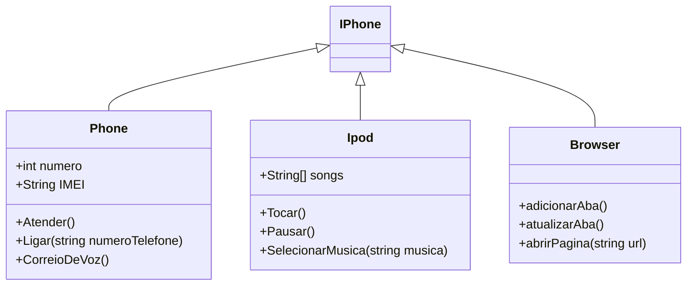

# [DIO](www.dio.me) - Trilha Java Básico

## Autores
- [Rodrigo Ferri]`

```mermaid
classDiagram
    IPhone <|-- Phone
    IPhone <|-- Ipod
    IPhone <|-- Browser
    class Ipod{
      +String[] songs
      +Tocar()
      +Pausar()
      +SelecionarMusica(string musica)
    }
    class Phone{
        +int numero
        +String IMEI
        +Atender()
        +Ligar(string numeroTelefone)
        +CorreioDeVoz()
    }
    class Browser{
        +adicionarAba()
        +atualizarAba()
        +abrirPagina(string url)
    }
```